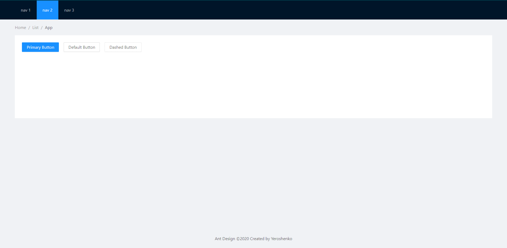
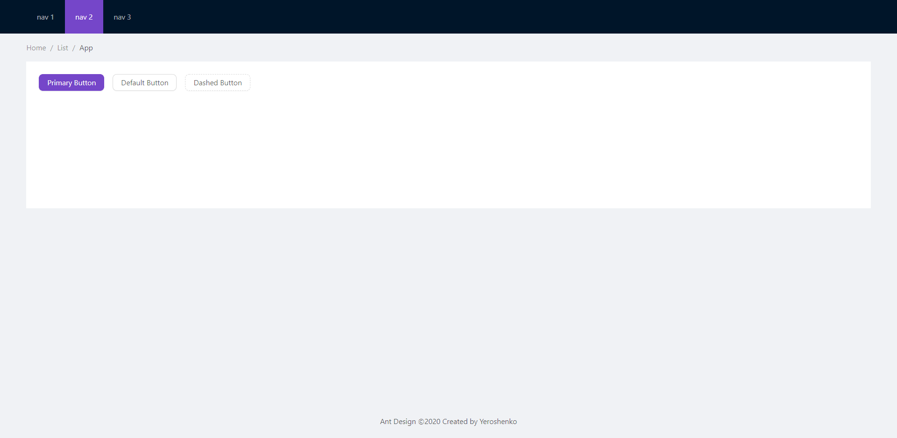

В последнее время я много делал домашних проектов с целью изучить новую технологию. Понятное дело что не хотелось очень сильно заморачиваться с дизайном, ну и тут на помощь приходят UI фреймворки. Среди всех известных мне UI фреймворков, больше всех меня зацепил Ant Design, своей простой и элегантностью. Слегка поработав с ним я понял что его можно использовать не только в пет-проектах , а и в продакшене. В сети есть много примеров крупных и не очень сайтов где он используется.  Но все эти сайты объединяет  то что они использую кастомизированную тему.

## Инициализация приложения

Для инициализации будем использовать **Create react app**.Создадим проект с именем ant-setup, переходим в корневую папку проекта и устанавливаем **Ant Design** с помощью команд:

```powershell
npx create-react-app ant-setup
cd ant-setup
yarn add antd
```

Ждем пока все установиться, открываем проект в редакторе кода и запускаем приложение:

```powershell
code .
yarn start
```

## Настройка Webpack

Далее нужно установить  пакеты для переопределения webpack конфигурации:

```powershell
yarn add babel-plugin-import react-app-rewired customize-cra
```

После этого изменим скрипты в нашем, `package.json` чтобы использовать `react-app-rewired`:

```json
"scripts": {
    "start": "react-app-rewired start",
    "build": "react-app-rewired build",
    "test": "react-app-rewired test",
    "eject": "react-scripts eject"
}
```

После всех этих манипуляций нужно создать файл с именем `config-overrides.js` в корневом каталоге проекта с этим кодом:

```javascript
const { override, fixBabelImports } = require('customize-cra')

module.exports = override(
  fixBabelImports('import', {
    libraryName: 'antd',
    libraryDirectory: 'es',
    style: 'css'
  })
)
```

Этими строчками мы подключили стили от Ant Design. Хейтер скажет: "Зачем так загоняться, ведь можно просто подключить прописать строчку `import 'antd/dist/antd.css'` в `index.js` ?". Если так сделать, то не получиться норм кастомизировать тему, так написано в документации. 

## Финальные штрихи

После всей проделанной работы мы можем использовать компоненты Ant Design. В файле `App.jsx`  я добавил несколько компонентов, и задал стили для демонстрации:

```jsx
import React from 'react'
import { Layout, Menu, Breadcrumb, Button } from 'antd'

const { Header, Content, Footer } = Layout

const App = () => (
  <Layout style={{ minHeight: '100vh' }}>
    <Header>
      <Menu theme='dark' mode='horizontal' defaultSelectedKeys={['2']}>
        <Menu.Item key='1'>nav 1</Menu.Item>
        <Menu.Item key='2'>nav 2</Menu.Item>
        <Menu.Item key='3'>nav 3</Menu.Item>
      </Menu>
    </Header>
    <Content style={{ padding: '0 50px' }}>
      <Breadcrumb style={{ margin: '16px 0' }}>
        <Breadcrumb.Item>Home</Breadcrumb.Item>
        <Breadcrumb.Item>List</Breadcrumb.Item>
        <Breadcrumb.Item>App</Breadcrumb.Item>
      </Breadcrumb>
      <div style={contentStyle}>
        <Button type='primary'>Primary Button</Button>
        <Button style={{ margin: '0 1rem' }}>Default Button</Button>
        <Button type='dashed'>Dashed Button</Button>
      </div>
    </Content>
    <Footer style={{ textAlign: 'center' }}>
      Ant Design ©2020 Created by Yeroshenko
    </Footer>
  </Layout>
)

const contentStyle = {
  backgroundColor: '#fff',
  padding: '24px',
  minHeight: '280px',
  display: 'flex',
}

export default App
```

Если ваше приложение уже запущено, вам необходимо перезапустить его, чтобы увидеть эти новые изменения.

Если все делали правильно то вы увидите:



Допустим, я решил использовать другой основной цвет. Очень просто!

Теперь осталось установить `less` и `less-loader` пакеты: 

```powershell
yarn add less less-loader
```

Затем просто добавить загрузчик LESS в файл `config-overrides.js`

```javascript
const { override, fixBabelImports, addLessLoader } = require('customize-cra')

module.exports = override(
  fixBabelImports('import', {
    libraryName: 'antd',
    libraryDirectory: 'es',
    style: true,
  }),
  addLessLoader({
    lessOptions: {
      javascriptEnabled: true,
      modifyVars: {
        '@primary-color': '#7546C9', // custom
        '@border-radius-base': '8px' // custom
      },
    },
  })
)
```

Результат: 



Самой приятное то что Ant Design имеет очень много переменных и можно очень сильно все преобразовать. С списком всех переменных можно ознакомиться по [ссылке](https://github.com/ant-design/ant-design/blob/master/components/style/themes/default.less).

## Заключение

В конце хочу сказать что это действительно хорошая библиотека она реально простая в использовании и не настолько заезженная как Bootstrap или Material Ui. И если вы с ней ещё не знакомы то советую ознакомиться.  [Исходный код](https://github.com/Yeroshenko/ant-setup).