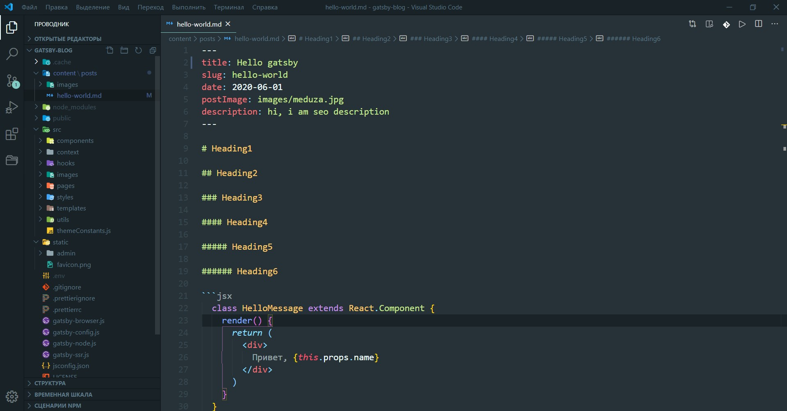
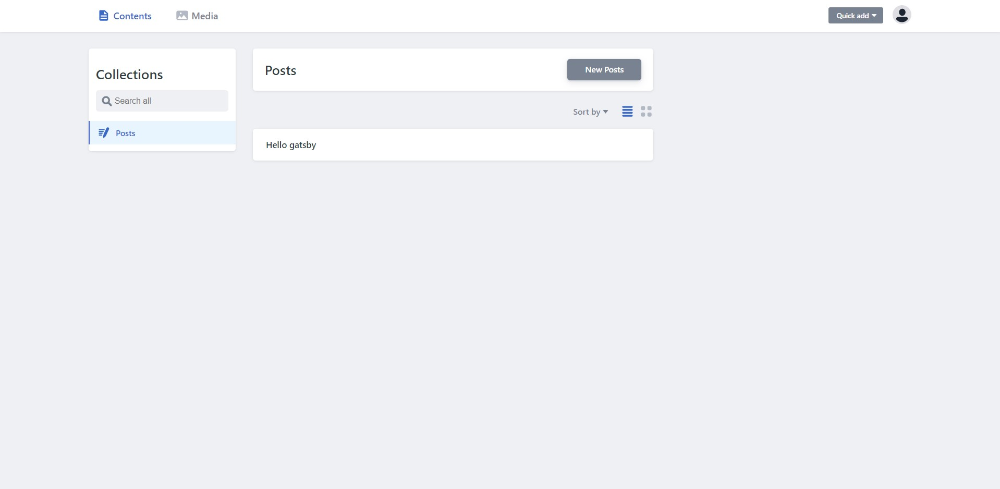
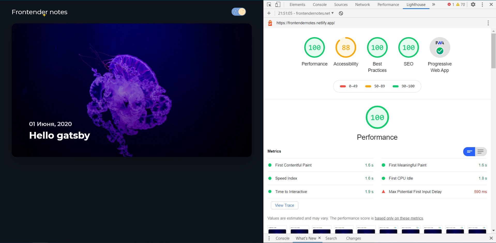

Вся история началась примерно 16 апреля, после просмотра [интервью](https://www.youtube.com/watch?v=Dic_VlZ_vn8) с [Егором Бугаенко](https://www.yegor256.com/about-me.html). В данном видео Егор сказал что каждый уважающий себя разработчик должен вести свой блог. И после этих слов у меня зародилась идея. 

## Стек технологий

Спустя некоторое время я начал думать над стеком технологий, сразу отбросил все популярные CMS вроде Wordpress, поскольку их не уважаю, ну и не сильно разбираюсь в php. И тогда я решил пилить фронт на react.js, а бек на node.js, норм связка, один язык для фронтенда и бэкенда, все круто. Но было одно  но - для любого блога нужна отличная SEO оптимизация, и тут я взгрустнул, поскольку понимал что нужен server-side рендеринг, но не имел понятия как это все устроенно. В тот момент я решил изучить next.js, и случайно вспомнил о JAM стеке. 

А что собственно JAM нам предлагает? А вот что:

* никакого server-side рендеринга, да и вообще убрать сервер как таковой
* никакого client-side рендеринга, долой `

`
* компилировать сайт в обычный HTML код, единожды, в момент изменения контента
* размещение сайта на любом файловом хостинге

То есть я пишу себе не реакте, а пользователь получает заранее отрендеренную страницу с полностью валидной версткой.  Ну и в качестве генератора статических сайтов я выбрал Gatsby.

## Знакомство и работа с Gatsby

Первый мой "Hello world" используя gatsby, если верить гитхабу, был 27 мая. Честно говоря  я думал что будет немного сложно и непонятно, но по факту тот самый react с graphql + несколько конфигурационных  файлов.

Все было круто, нарисовал макет в фигме, разобрался с роутингом и плагинами в gatsby,  начал делать темную тему и тут первая трудность. Сначала я начал делать темную тему сам, но самым простым и самым не правельным способом, как в [этом репозитории](https://github.com/Yeroshenko/dark-theme). Реализация занимала несколько минут, но появлялось бесящее мерцание, когда была светлая тема и сразу на темную при обновлении страницы. Тогда я нашел плагин **gatsby-plagin-dark-mode**, вроде все круто, не надо париться, удобно использовать, но я не знаю почему, но у меня было то самое дурацкое мерцание при обновлении, хотя не должно было быть. Немного погрустив я нашел [крутейшую статью](https://joshwcomeau.com/gatsby/dark-mode/) о том как это самостоятельно реализовать.  

## Управления контентом

Далее без неприятностей, спустя 8 дней у меня был плюс минус готовый блог, но посты у меня хранились в .md файлах. Вот примерно так: 

Сверху у меня картинка, заголовок и другая информация, а снизу сам текст поста. Что-то мне такой подход не очень нравился и я решил прикрутить какую-то headless CMS, мой взгляд упал на Netlify CMS, поскольку она генерирует те самые .md файлы, ну и поскольку использую netlify в качестве хостинга.  Создав не сложный конфиг у меня получилась такая вот админ панель: 

## Заключение

В итоге у меня получился новомодный PWA с всевозможными оптимизациями, кэшированием, умной предзагрузкой контента и почти по 100 балов в lighthouse ( 88 за доступность, траблы с переключателем темы, на днях переделаю). Я думаю что это достойный результат за такие сроки. [Ссылка на репозиторий](https://github.com/Yeroshenko/gatsby-blog).

В конце хочу сказать что для меня это был огромный опыт и мне очень понравились это время от момента зарождения идеи до написания этой, самой первой статьи в моей жизни. Понятно что я буду улучшать этот блог, в планах написать несколько постов и прикрутить пагинацию, метки, какие-то прикольные анимации вроде тех звездочек что на лого. И да ещё лого придумать и может быть название сменю, но это уже совсем другая история...