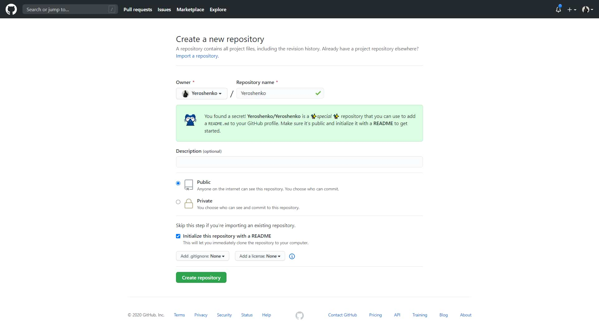

Хотел бы поведать вам о новой возможности про на github. А точнее о том как создать и норм оформить profile readme файл. Дам несколько советов и полезных ссылок.

## 1. Создание репозитория

Для начала создадим новый репозиторий, но название должно совпадать с никнеймом пользователя. Ну и репозиторий должен быть публичным. 

##  2. Оформление

После создания, переходим README.md файл и видим дефолтный список фактов, нужно раскомментировать и дополнить его. Сохраняем и смотрим на свой профиль.

Можно и так оставить, но если хотите лучше оформить то вот вам несколько полезных ссылок:

* [Awesome Github Profile](https://zzetao.github.io/awesome-github-profile/) - сайт с примерами profile readme файлов, есть возможность сортировки по категориям.
* [Github Readme Stats](https://github.com/anuraghazra/github-readme-stats) - крутые виджеты  со статистикой о репозитории для readme файлов.

Ну для того что-бы норм оформить readme файл я вам советую просто посмотреть с помощью [Awesome Github Profile](https://zzetao.github.io/awesome-github-profile/) на другие профили, вдохновиться, узнать какие-то фишки. 

В конце оставлю [ссылку на мой профиль](https://github.com/Yeroshenko), можете оценить, я старался.